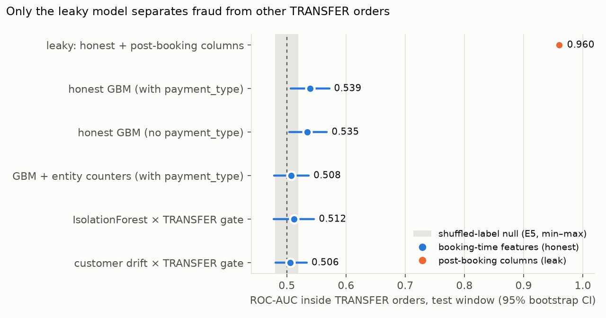
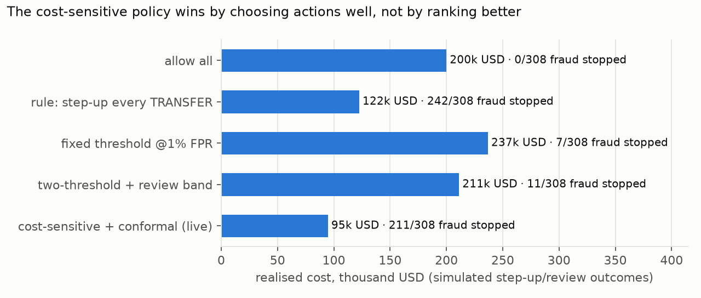

# Comparison: FraudShield on the real DataCo data (e0–e5 + pipeline replay)

Data: `prototypes/data/cleaned_dataco.csv`, 180,519 order items rolled up to 65,752 orders
(2015-01-01 → 2018-01-31). The label is `order_status == SUSPECTED_FRAUD`: 1,488 orders (2.26%) from 1,429 customers.
Split by time, never shuffled: train 2015–2016 (41,763 orders, 941 fraud), validation 2017-H1 (10,319 / 239),
test 2017-07 → 2018-01 (13,670 / 308). Every number below is on the test window. Run `python3 -m pytest tests/`
to check the feature contract.

## 1. Leakage audit: what the cleaned CSV still contains

| Column | Fact (all orders) | Verdict |
|---|---|---|
| `order_status` | `SUSPECTED_FRAUD` is the label | dropped |
| `delivery_status` | 100% of fraud orders are 'Shipping canceled' (1,488 of the 2,855 orders with that status) | **leak**: recorded after the order is stopped |
| `late_delivery_risk`, `is_late` | 0 for 100% of fraud | **leak**: post-shipping |
| `days_shipping_real`, `shipping_date`, `shipping_delay_days` | only exist once the parcel ships | **leak** |
| `payment_type` | every fraud order is TRANSFER (8.2% of TRANSFER orders); CASH/DEBIT/PAYMENT have 0. Each `order_status` occurs under exactly one payment type | allowed, but **looks generated from the status**, so every result is reported with and without it |
| item vs order grain | the label never differs between items of one order | split and score per order |

`dataco_features.assert_no_leak()` enforces this. The flip test (flip every test-window label, then check
that no earlier feature changes) proves the history and entity counters are point-in-time.

## 2. Head-to-head (test window)

The **TRANSFER** column is the one that matters. All fraud is TRANSFER, so the all-orders AUC of any model
that knows the payment type starts at about 0.87 for free.

| Exp | Approach | ROC-AUC, all orders | ROC-AUC, TRANSFER only [95% CI] | PR-AUC, TRANSFER (base rate 0.081) |
|---|---|---:|---:|---:|
| E0 | GBM + post-booking columns (**leaky**) | 0.990 | 0.960 [0.954, 0.965] | 0.529 |
| E1 | rule: flag TRANSFER | 0.870 | 0.500 (constant) | 0.081 |
| E2 | honest GBM, with payment_type (5-seed mean) | 0.880 | 0.539 [0.507, 0.572] | 0.093 |
| E2 | honest GBM, no payment_type | 0.533 | 0.535 [0.504, 0.568] | 0.092 |
| E3 | E2 + entity-graph counters | 0.872 | 0.508 [0.479, 0.537] | 0.083 |
| E4 | IsolationForest (unsupervised) | 0.873* | 0.512 [0.478, 0.546] | 0.086 |
| E4 | per-customer drift (unsupervised) | 0.871* | 0.506 [0.481, 0.534] | 0.083 |
| E5 | E2 trained on labels shuffled inside TRANSFER (20 runs) | — | 0.501 ± 0.013 (range 0.480–0.519) | — |

\* E4 scores are gated by the TRANSFER rule in the all-orders scope.

E5 permutation test: the real-label E2 model (seed 1, 0.522) beat all 20 shuffled-label runs. The empirical
p-value is 0.048, which is the smallest possible with 20 permutations.

## 3. What each experiment revealed

**E0, leaky baseline.** The ~0.99 AUC that DataCo fraud notebooks usually report is reproduced exactly, and
SHAP shows where it comes from: `leak_canceled` (delivery_status) carries 92% of the gain. The four post-booking
columns *alone* reach 0.988. This is a cautionary slide, not a model.

**E1, the rule.** "TRANSFER means suspicious" catches 100% of fraud while flagging 27.7% of orders, at 8.1%
precision. Every honest model below matches it in the all-orders scope and adds almost nothing.

**E2, honest GBM.** Within TRANSFER, the seed-averaged model reaches ROC-AUC 0.539. The bootstrap CI only just
excludes 0.5, and the per-seed values range from 0.519 to 0.548. PR lift is 1.14×, so at a 5% false-positive
rate it catches 7% of TRANSFER fraud. Without payment_type the model early-stops after about 7 trees. The
top SHAP features (order_region, discount, profit) are what a model fits on noise.

**E3, entity graph.** The homophily check is the clearest negative result. A TRANSFER order whose destination
city, product or customer home city recently carried fraud has the *same* fraud rate as one that did not
(ratios 0.97–1.03). A customer with a prior fraud order is slightly *less* likely to commit fraud again (0.075 vs 0.083).
Fraud in DataCo does not cluster on shared entities, so the ring/mule machinery from experiment B has
nothing to find. Adding the counters lowers the TRANSFER AUC to 0.508 (more noise to fit).

**E4, anomaly.** Fraudulent orders are no more unusual than legitimate ones, either globally (IsolationForest)
or against the customer's own history (drift).

**E5, null.** The harness is sound: shuffled labels give 0.50 ± 0.01. E2's 0.52–0.54 sits just above that range.
**Overall reading:** beyond payment type there is at most a very weak, unstable signal (it disappears when the
feature set changes, as in E3). Together with the flat monthly fraud rate (6–12% inside TRANSFER month to month, no trend;
see `visuals/dataco_fraud_by_month.png`) and the exact status↔payment partition, the most consistent explanation
is that DataCo's `SUSPECTED_FRAUD` label was assigned at random among TRANSFER orders when the dataset was
generated. That is an inference from the evidence, not something the dataset documents.

## 4. Pipeline replay (`prototypes/fraudshield-pipeline/demo_dataco.py`)

The whole FraudShield path ran unchanged on 13,670 real orders: calibrated GBM → Mondrian conformal → cost-sensitive
decision → hash-chained ledger. The ledger verified, tampering was detected, and an order replayed from its stored vector reproduced bit-for-bit.

| Policy | Realised cost (USD) | Fraud stopped | Legit blocked |
|---|---:|---:|---:|
| allow all | 200,026 | 0 / 308 | 0 |
| step-up every TRANSFER (rule) | 122,499 | 242 / 308 | 97 (0.73%) |
| fixed threshold @1% FPR | 236,817 | 7 / 308 | 58 (0.43%) |
| two-threshold + review band | 211,181 | 11 / 308 | 23 (0.17%) |
| **cost-sensitive + conformal (live)** | **94,736** | 211 / 308 | 39 (0.29%) |

Reading, with caveats:
- Threshold policies are *worse than allowing everything*: thresholds at 1% FPR land inside TRANSFER, where the
  ranking is random, so they block legitimate orders and catch almost no fraud.
- The cost-sensitive policy wins because it uses p ≈ 8% (TRANSFER) vs ≈ 0 (others) together with each
  order's value and the customer's value to pick STEP_UP / HOLD / ALLOW. That is a decision-layer win, not a
  detection win. It is the one FraudShield component whose value survives on this data.
- Step-up and review outcomes are **simulated** (`CostParams` pass and catch rates), money is the order value in USD,
  LTV = max(2 × prior spend, order value), and an analyst costs 5 USD. None of these come from DataCo. Re-run with your own values before quoting costs.

## 5. Synthetic vs real

| | synthetic stream (`simulate.py`) | DataCo (real) |
|---|---|---|
| Best honest ROC-AUC | 0.998 | 0.880 all orders / 0.54 inside TRANSFER |
| Graph signal | 83% of fraud touches known-bad entities | none (homophily ratio ≈ 1.0) |
| Behavioural drift | AUC 0.968 | ≈ 0.51 |
| What transfers | the whole architecture, the leak discipline, the ledger, the cost-sensitive policy | the same, but the *models* have nothing to learn |

The synthetic results show the architecture *can* detect structured fraud. The DataCo results show it
does not invent signal where there is none, and that the leak discipline is what keeps the reported numbers honest.

## 6. Recommended next steps

1. **Use DataCo as a plumbing and leakage benchmark, not as a model-quality claim.** Quote E0 vs E2 as the story:
   "0.99 with leaks, 0.54 without".
2. **Get a dataset with a learnable fraud signal** for model claims: IEEE-CIS Fraud Detection (real card
   transactions), PaySim (synthetic mobile money, with structure), or the
   Kaggle credit-card fraud data. Re-use `dataco_protocol.py`: same split discipline, same CI reporting.
3. **Cost and conformal sweeps on DataCo.** These are items 1 and 6 in `next-experiments.md`. The decision layer is the part with real effect here,
   so measure how sensitive its advantage over "step-up every TRANSFER" is to `fraud_pass`, `churn_if_blocked` and analyst cost.
4. **Order-status as a multi-class target** (exploratory). Predict PENDING / PROCESSING / CANCELED / SUSPECTED_FRAUD
   jointly inside TRANSFER. If CANCELED is predictable and fraud is not, that strengthens the
   random-label reading.
5. **More permutations for E5** (200+) to tighten the p-value on E2's weak signal.
